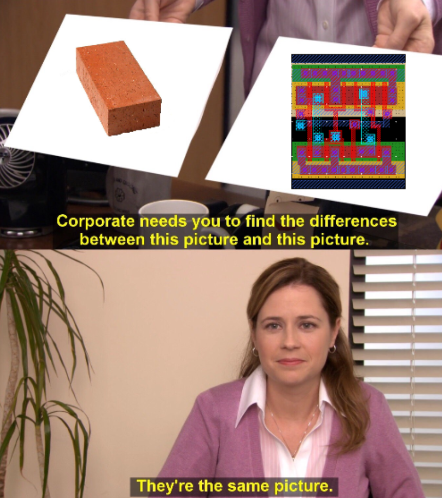
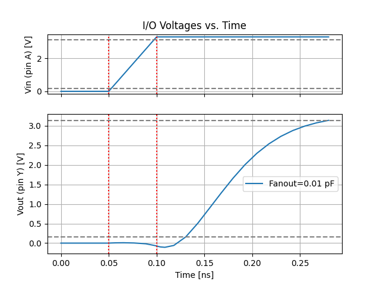
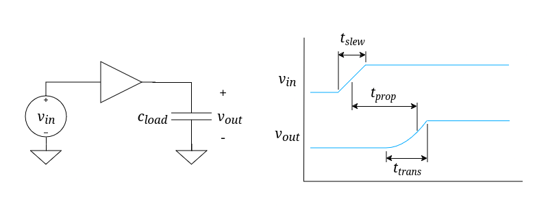
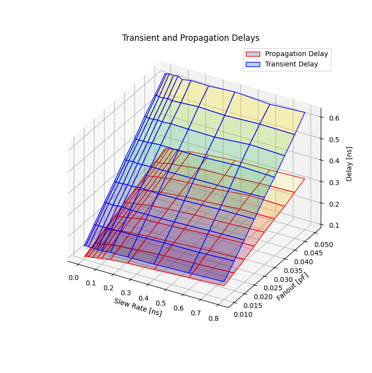

In this first entry in the [Laymanized]() series, we'll take a
look at my first publication and dive into the topic of standard cell characterization.

<!--more-->

### First, a brief Disclaimer

I do NOT intend for this site to be exclusively a showcase for my own work. I want to talk about
all sorts of stuff from all sorts of people, like [David Harvey's optimizations to NTT](https://www.sciencedirect.com/science/article/pii/S0747717113001181)
or [David Harris's taxonomy for parallel prefix networks](https://ieeexplore.ieee.org/abstract/document/1292373).
(Also, I'm not just going cover works from people named David H. This was a coincidence, I 
promise). However, if I'm going to try to explain difficult and complex VLSI topics, it's nice
to start with stuff I know.

Ok, disclaimer over. Let's get into this.

### Some Assumptions

I'm going to assume that you, as an intellectual, have some knowledge going into this. Probably a
big part of why you clicked on this article, right?

- You should have at least a basic understanding of Boolean logic
- You should be able to identify the components of a circuit diagram (including logic gates) and
know how they work on a basic level
- You should know how to read a line graph
- You should be aware of hardware descriptons languages such as verilog or VHDL (but don't worry,
we won't be working with any code here)

Now that that's out of the way...

## Let's Start with a bit of Background

Even if you've studied electronics at a university level, odds are pretty good that this is your
first time hearing the term "standard cell", let alone paired with "library" and "characterizer".
We'll begin by breaking down what those terms mean.

### What are Standard Cells?

In the simplest terms, **standard cells are digital building blocks implemented in a consistent,
standardized way**. They're the same logic gates you know and love, just a bit more... standard.

Perhaps an analogy will explain this a little better.

> Imagine you're building a house. You've got the framing up and the roof on, and now it's time to
cover up the exterior walls with siding. You can hire an expert stonemason who will build you a
beautiful natural stone veneer, but the job will take a month, and they charge expensive rates for
their expertise. Or instead, you can hire a bricklayer who will have the job done by the end of the
week for a fraction of the cost. 
>
> See the difference here? The stonemason has to work with the shapes of the stone he or she is
given. The bricklayer doesn't have to worry about that at all - all the bricks have the same
dimensions, so it doesn't matter that brick A is next to brick C instead of brick B. As a result,
the brickwork is quick and cheap by comparison, and the bricklayer doesn't have to be a master of
his craft (though it certainly helps).

It's the same way with electronics. Standard cells (like bricks) have a fixed height, so we can
place them in rows (like bricks) to get a clean, organized design. A master engineer (like the
stonemason) could likely do a better job without those rows, but it would probably take them so
long that it isn't worth the cost and effort.

If that analogy didn't make sense to you, maybe this way of thinking about it will. Think of
standard cells like Lego bricks: they all have the same height, and they connect in predictable
ways. They aren't all exactly the same shape. Some are wider than others and some are narrower.
On their own they aren't very special. But put a bunch of them together, and you can create
something much more interesting. 

When using standard cells, we don't have to think about physical design problems, such as how
transistor M1 connects to to transistor M3 with wires that are a few nanometers wide. Instead we
get the luxury of abstraction: we can just think about how the logic works. This seriously reduces
the amount of work involved in implementing a design, and has saved this engineer many headaches.

There are a lot of other problems that standard cells solve for us, but we won't go into that here.
That's a topic for another post.

### Ok, but what does a Library have to do with it?

**A standard cell library is a collection of standard cells that are made to work well together**.
They'll all have the same height, and you'll have cells for all the major logic components: AND,
OR, XOR, NAND, et cetera. You'll also have things like inverters, buffers, and flip-flops. Think of
a standard cell library like a toolbox full of devices for working with digital logic.

Seems pretty straightforward, right? But consider how powerful this idea is! With a standard cell
library, I can take *any digital logic design* and turn it into a real physical design. We even
have automated tools to do this. You hand the tool a standard cell library and some HDL, and the
tool "synthesizes" your design using the cells in the standard cell library.

> If you're working with a standard cell library, you've probably come across the term "process
design kit" (or PDK for short). A PDK is a larger set of documents, tools, and design
data relavant to a particular semiconductor manufacturing process. For an example, check out
[this open source PDK based on SkyWater's 130nm process](https://github.com/google/skywater-pdk).
>
> Don't get confused: a standard cell library is not the same thing as a PDK. Usually a PDK will
contain a standard cell library, but it's just a small part of a much bigger collection of tools.
However, you may occasionally see standard cell libraries referred to as "cell kits".

There's a little more to synthesis than just replacing all the &'s in your HDL with cell names, of
course. A good synthesizer considers the electrical properties of cells and makes tweaks to your
design to ensure everything will work right. Different synthesizers do this differently, but they
all have one thing in common: they have to know the properties of every standard cell in the
library.

How do we determine the electrical properties of standard cells in a library? Through
characterization.

## Standard Cell Library Characterization

**Characterization is the process of determining the characteristics of something**. This doesn't
just apply to electronics, of course. You can characterize all sorts of things in all sorts of
ways. I can characterize an apple as sweet and crisp. Or I could characterize an Apple as a thin
and light laptop with a retina screen and an M3 processor.

Of course, in the context of standard cells, we want very specific information. **Standard cell
characterization is the process of measuring how a cell shapes signals input signals**.

Let's pause and unpack that a bit. What do we mean when we talk about shaping input signals? 

### A simple example

Consider the simplest cell: a 1-bit buffer. It has a single input and a single output. If you feed
in a logical 1, it will spit out a logical 1 and likewise for logical 0. Its whole job is to give
you the exact same value you put into it.

Now let's say I connect the input of a buffer to a signal generator, connect the output to a small
capacitor, and feed in a signal that slews from 0 to 1 over a very short amount of time, like this:

")

We can expect the output to look exactly the same, right? Well, almost. Reality is a bit more
complicated than that. Take a look at the simulation results below. 

> For completeness: these plots are generated using CharLib with the standard cells in the open
source [gf180mcu_osu_sc PDK](https://github.com/stineje/globalfoundries-pdk-libs-gf180mcu_osu_sc).

As it turns out, the buffer introduces a little bit of delay to the signal; it takes time for the
change in the input signal to "propagate" through to the output signal. This is called the
"propagation delay", or \\(t_{prop}\\) for short.

It also takes a little longer for the output signal to transition from 0 to 1 than the input signal
does. This is called the "transient delay", or \\(t_{trans}\\).

Both of these values change depending on the structure of the standard cell we're testing, the
amount of capacitance we connect to the output (\\(c_{load}\\)), and the amount of time we give the
input signal to slew (\\(t_{slew}\\)), among many other factors.

For combinational cells (logic gates, buffers, inverters... pretty much anything that doesn't
require a clock input for sequencing), these two delay characteristics provide a pretty good model
of how the cell will respond to input.

But what if we feed in an input signal that transitions faster or slower? Or what if we put a
larger capacitor on the output, so that the cell has to do more work in order to charge it to a
logical 1?

### Changing conditions

If we want to have a good model of how our buffer shapes signals, we need to take measurements
under a bunch of different conditions. Those conditions include (at minimum):

- \\(t_{slew}\\), the amount of time the input signal takes to "slew" or transition from 0 to 1.
This is also known as the slew rate. It's usually measured in nanoseconds or picoseconds.
- \\(c_{load}\\), the total capacitance the cell has to drive on the output. This is also called
"fanout" (for reasons we'll get into later), and is usually measured in picofarads or femtofarads.

This is where things start to get complicated. We want to see how varying both of these conditions
*at the same time* affect the cell's \\(t_{prop}\\) and \\(t_{trans}\\). So, for every value of
\\(c_{load}\\) we want to test, we have to simulate with every value of \\(t_{slew}\\). This
results in a 3-dimensional *surface* of data for each delay value we want to measure. Our test
conditions are shown along the x and y axes, and the delay is plotted on the z-axis.

### This isn't as easy as it sounds

Everything we've discussed so far has been in the context of the humble buffer. Like platypuses 
(platypi? platypeople?), they don't do much. The moment we start talking about anything more
complicated, we have problems to solve.

For example, consider a simple 2-input AND gate. It's not a complicated device, by any stretch of
the imagination. But since it has 2 inputs, we have to deal with some additional complexities:

- There are now paths through the gate (one path from each input to the output), and each may shape
signals in different ways.
- If we're testing the path from input A to the output, we have to make sure input B has a logical
1 (otherwise it would "mask" the signal, and we would never see it propagate through to the output).
We call this the "nonmasking condition" for input B.

This is still just a simple gate, of course. Sequential devices, such as latches and flip-flops,
add a boatload of extra problems:

- We now have to stimulate the cell with a clock signal that has an appropriate period and slew
rate, in addition to stimulating the inputs.
- Not only do we have to deal with multiple inputs, but we also have to make sure we measure the
correct state transition. The more states a cell has, the more complex this is.
- Since we don't know what state the cell will be in after initilization, we have to develop
procedures to reset each device to a known state *before testing anything*, then perform this reset
procedure for every test we run.
- Memory devices have specific timing requirements: 
    - Inputs have to be held stable for a particular amount of time before the clock edge. This is
    called the **setup time**, or \\(t_{setup}\\).
    - Inputs also have to be held stable for some amount of time *after* the clock edge. This is
    the **hold time**, \\(t_{hold}\\).
    - \\(t_{setup}\\) and \\(t_{hold}\\) have an interdependent relationship, as explored by
    [Salman et. al](https://ieeexplore.ieee.org/abstract/document/4167994). So adjusting one might
    affect the other, and vice versa.

Clearly complexity scales up, fast. Any additional factor we add, like an extra input or internal
state, may double or even triple the amount of work we have to do to characterize a cell. And we
have whole libraries of them to deal with! Yuck!

### Is it even worth it?

Gee, this sure sounds like a lot of work to do just to measure some timings. Wouldn't it be better
if we just, y'know, didn't do all this characterization stuff? Unfortunately for ~~lazy~~ efficient
engineers like you and me, there are good reasons behind the standard cell characterization
process. It all comes down to the need for faster logic.

Consider a small design like this:

> TODO: add picture of a design that has some fanout to it

See how we have the output of one gate driving the inputs to several other gates? Each of those
gates has a very small amount of **input capacitance**. They don't have much on their own, but
when they connect in parallel like this it can become significant. Together they act a lot like one
larger capacitor on the output of the driving gate. Perhaps you can see where I'm going with this.

When the first logic gate receives an input, the signal will propagate through it and incur some
amount of delay. If we know how many cells it has to drive, we can sum up their input capacitance
and **accurately predict how much delay the cell incurs**. We repeat this for each logic gate,
using our previous characterization results to inform how much delay we need to add at each logic
step. Using this method, we can reliably estimate the total delay between any 2 points in our
design.

## CharLib

Now that we understand standard cell characterization, we can dig into this paper.
